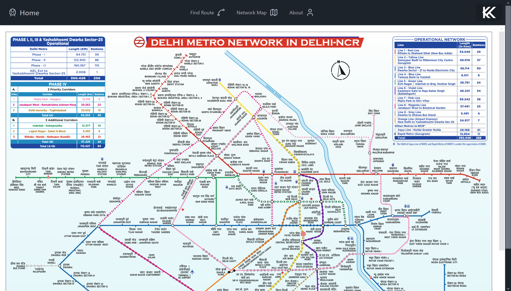
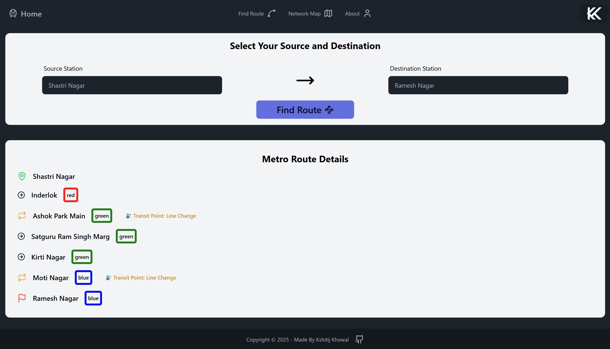

# 🚇 Delhi Metro Navigator App

A user-friendly **Delhi Metro Navigator App** designed to provide seamless navigation, route planning, and fare estimation for the Delhi Metro network.



## 🚀 Features

- **Route Planner:** Find the shortest and most efficient metro routes.
- **Interactive UI:** Easy-to-use interface with responsive design.



## 🛠️ Tech Stack

- **Frontend:** React Vite, Tailwind CSS, Daisy UI
- **Routing:** React Router
- **Version Control:** Git & GitHub

## 📦 Installation

1. Clone the repository:
   ```bash
   git clone https://github.com/kshitijkhowal/delhi-metro-navigator
   ```
2. Navigate to the project directory:
   ```bash
   cd delhi-metro-navigator
   ```
3. Install dependencies:
   ```bash
   npm install
   ```
4. Start the development server:
   ```bash
   npm run dev
   ```
5. Open your browser and navigate to:
   ```
   http://localhost:5173
   ```

## 📝 Usage

1. Enter your source and destination metro stations.
2. Get the optimal route along with fare and travel duration.
3. Explore additional station details.
4. Plan your metro travel efficiently.


## 🎥 Demonstration

Check out the app in action:


## 🎯 Learning Outcomes
- Deep understanding of React and state management.
- Integration of interactive UI components with Daisy UI.
- Hands-on experience with efficient routing using React Router.
- Real-world problem-solving with metro route optimization.

## 🤝 Contributing

Contributions are always welcome! Follow these steps:
1. Fork the repository.
2. Create a new branch:
   ```bash
   git checkout -b feature/your-feature
   ```
3. Commit your changes:
   ```bash
   git commit -m "Add your feature"
   ```
4. Push to the branch:
   ```bash
   git push origin feature/your-feature
   ```
5. Open a Pull Request.

## 📄 License

This project is licensed under the MIT License.

## 📬 Contact
- **Name:** Kshitij
- **Email:** [kshitij.durgesh@gmail.com](mailto:kshitij.durgesh@gmail.com)

---

Made with ❤️ by Kshitij Khowal
